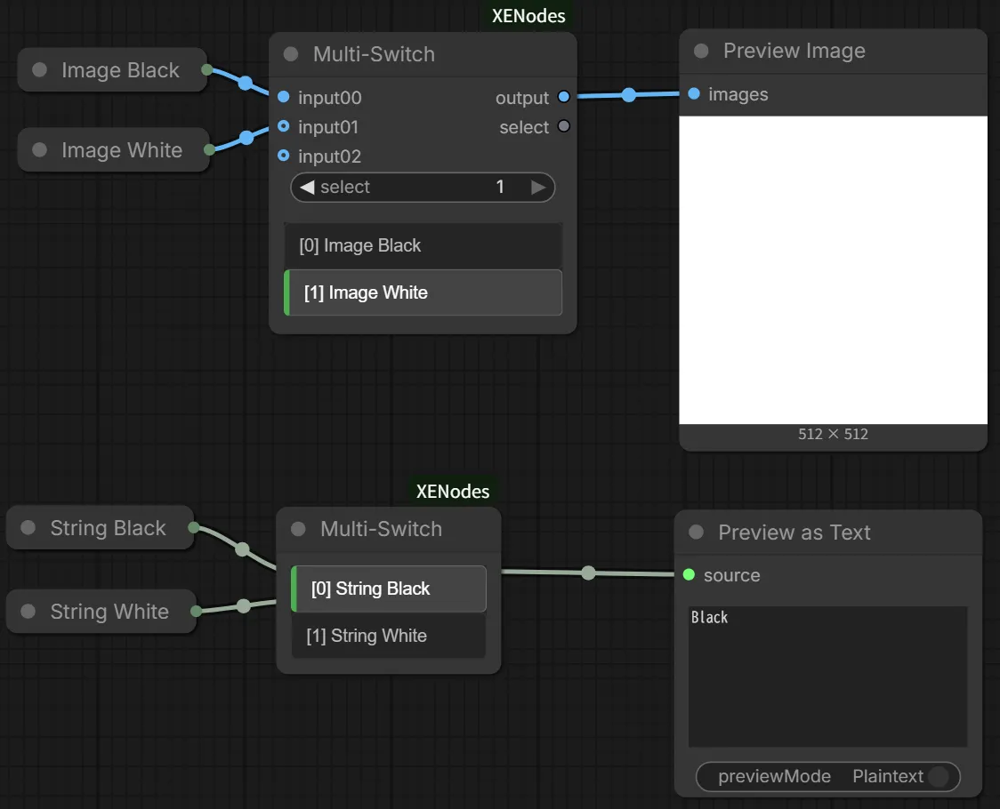

# ComfyUI-XENodes

A collection of custom nodes for ComfyUI, featuring the versatile Multi-Switch node.

## Installation

1. Clone this repository into your `ComfyUI/custom_nodes` directory:

   ```bash
   cd ComfyUI/custom_nodes
   git clone https://github.com/xeinherjer-dev/ComfyUI-XENodes.git
   ```

2. Start (or restart) ComfyUI.

## Included Nodes

### Multi-Switch

A general-purpose switch node that selects one input from many and routes it to a single output.

- **Autogrow**: Input slots automatically increase as you connect more nodes.
- **Custom UI**: Convenient selection buttons are displayed directly on the node, showing the source node names of connected inputs.
- **Hide Connections**: Toggle the visibility of connection slots via the right-click menu to keep your workflow clean and compact.

## Screenshots


