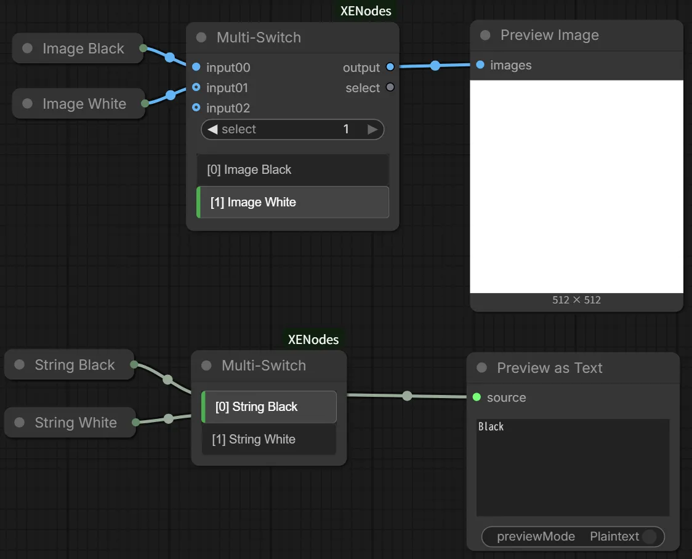
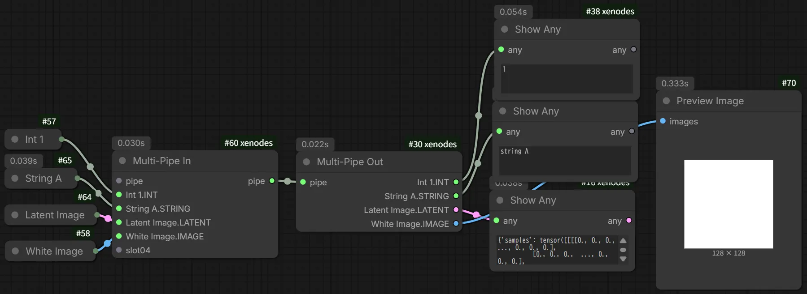

# ComfyUI-XENodes

A collection of custom nodes and UI extensions for ComfyUI, featuring Multi-Switch, Multi-Pipe, Slider, Slider 2D, SDR to HDR, Save Image, Save Video, Save Audio, Combo Selector, Show Any, Load Image From Folder nodes, and Node Execution Time helper.

## Features

- **Nodes 2.0 Support**: Modern UI and compatibility for latest ComfyUI versions.

## Requirements

- **FFmpeg**: Required for `Save Video`, `Save Image` (AVIF format), and `Save Audio` nodes. Ensure `ffmpeg` is installed and available in your system's PATH.

## Installation

1. Clone this repository into your `ComfyUI/custom_nodes` directory:

   ```bash
   cd ComfyUI/custom_nodes
   git clone https://github.com/xeinherjer-dev/ComfyUI-XENodes.git xenodes
   ```

2. Start (or restart) ComfyUI.

## Included Nodes

### Multi-Switch

A general-purpose switch node that selects one input from many and routes it to a single output.

- **Nodes 2.0 Compatible**: Dynamic UI that stays clean and responsive in the latest ComfyUI.
- **Autogrow**: Input slots automatically increase as you connect more nodes.
- **Custom UI**: Convenient selection buttons are displayed directly on the node, showing the source node names of connected inputs.
- **Hide Connections**: Toggle the visibility of connection slots via the right-click menu to keep your workflow clean and compact.



### Multi-Pipe

Bundle multiple inputs into a single `XE_MULTI_PIPE` connection and unpack them later.

- **Autogrow**: Input slots on `Multi-Pipe In` automatically increase as you connect more nodes.
- **Dynamic Sync**: `Multi-Pipe Out` automatically synchronizes its output names with the connected `Multi-Pipe In` node.


### Slider

A versatile slider node where the output port type dynamically switches between `INT` and `FLOAT` based on the `step` setting.

- **Dynamic Type Switching**: Automatically sets the output type to `INT` for integer steps and `FLOAT` for decimal steps, ensuring seamless connectivity with other nodes.
- **Automatic Casting**: During backend execution, numerical values are appropriately output as `int` for whole numbers and `float` for fractional ones.

### Slider 2D

An intuitive 2D slider node for manipulating X and Y values simultaneously on a coordinate plane.

- **Precision Auto-Detection**: Automatically adjusts the display precision (number of decimal places) based on the `stepX` and `stepY` settings.
- **Dynamic Type Switching**: Similar to the Slider node, the output port types for each axis change dynamically based on their respective step settings.
- **Snap Feature**: Enable the `snap` property to snap the handle to the specified step increments.

### SDR to HDR

Expands SDR images, video frames, or video into 10-bit HDR using Inverse Tone Mapping and wide color gamut conversion.

- **Inverse Tone Mapping (ITM)**: Soft-knee luminance expansion with configurable `peak_nits`, `itm_knee`, and `itm_exponent`.
- **Wide Color Gamut**: Converts linear BT.709 to linear BT.2020 color space.
- **HDR Transfer Functions**: Supports both **HDR(PQ)** (SMPTE ST 2084 / HDR10) and **HDR(HLG)** (ITU-R BT.2100) curves.
- **Image & Video Support**: Accepts `IMAGE` or `VIDEO` inputs and outputs HDR `IMAGE` and 10-bit HDR `VIDEO`.
- **Chunked Processing**: Memory-safe batch execution for high-resolution images and video frames.

### Save Image

An image saving node with configurable format, compression, and HDR support.

- **Format Support**: Encode to `png`, `webp` (with lossless and quality control), or 10-bit `avif`.
- **Automatic HDR Detection**: Automatically detects HDR color space metadata from `SDR to HDR` and applies proper CICP parameters for AVIF export.
- **Metadata Embedding**: Embeds ComfyUI workflow and prompt metadata into AVIF (via `exiftool`), PNG, and WebP.

### Save Video

A video saving node with configurable format, codec, and 10-bit HDR encoding support.

- **Format & Codec Support**: Encode to `mp4` or `webm` using `h264`, `h265`, `av1`, or GPU-accelerated NVENC codecs.
- **HDR Pipeline**: Automatically applies 10-bit pixel formats (`yuv420p10le`, `p010le`) and BT.2020/PQ/HLG metadata tags to FFmpeg when processing HDR video.
- **Quality Control**: Configurable `crf` and audio bitrate settings.

### Save Audio

Save audio clips natively with professional codec support.

- **Format Support**: Encode to `mp3`, `opus`, or `flac`.
- **Bitrate Control**: Select from standard bitrates or use variable bitrate (V0) for MP3.
- **Native Preview**: Includes a built-in audio player for immediate feedback in the ComfyUI interface.

### Save HDR Image / Save HDR Video `[Deprecated]`

> [!WARNING]
> These standalone experimental nodes are now deprecated. Please use **`SDR to HDR`** combined with **`Save Image`** (AVIF) or **`Save Video`** instead.

### Combo Selector

A utility node that allows selecting a COMBO (dropdown) value by its numerical **index**.

- **Auto-Discovery**: Dynamically reads the available options from the connected target node.
- **Index Selection**: Input an `INT` to select items by index.
- **Dual Output**: Provides both **COMBO** and **STRING** types for flexible connectivity.

### Show Any

A visual debug node that displays any input value as text directly on the node.

- **Any Input**: Accepts any data type and converts it to a readable string representation (JSON for complex objects).
- **Composite ID Support**: Fully compatible with Nodes 2.0 Group Nodes, ensuring progress is saved correctly even when nested.

### Load Image From Folder

Loads a single image from a directory or direct file path without resizing, designed specifically for batch queue workflows and Vision LLMs (e.g., Ollama).

- **No Resizing / Quality Loss**: Retains the exact original resolution and aspect ratio as a single image tensor (`[1, H, W, 3]`).
- **Built-in Image Preview**: Automatically displays a preview of the loaded image directly on the node upon execution.
- **Auto-Increment & Loop**: The `index` input supports `control_after_generate` (`increment`, `randomize`, etc.) for seamless sequential processing, automatically looping back to the first image when exceeding the total count.
- **Multiple Sort Modes**: Sort by filename (`name`), `date_modified`, `date_created`, or `random`, with options for `reverse` and recursive `subfolders` search.
- **Windows / WSL Path Compatibility**: Automatically resolves Windows path formats (e.g. `C:\Users\...`) to WSL paths (`/mnt/c/Users/...`) when running in WSL environments.
- **Rich Metadata Outputs**: Outputs `IMAGE`, `MASK`, `filename` (STRING), `filepath` (STRING), `index` (INT), and `total_images` (INT).

### Node Execution Time (UI Extension)

Measures and displays the execution time for each node in your workflow directly on the node itself.

- **Subtle Badges**: Renders non-intrusive gray badges displaying execution times in milliseconds (`ms`) or seconds (`s`).
- **Subgraph Support**: Recursively calculates and sums up the execution times for ComfyUI GroupNodes and standard LiteGraph subgraphs.
- **Double Counting Prevention**: Automatically detects if other extensions (e.g. `comfyui-easy-use`) have already measured the time, avoiding double counting.
- **Toggleable**: Easily enable or disable the display via the ComfyUI Settings panel under `XENodes -> Node Execution Time`.

### Progress Bar (UI Extension)

A powerful, subgraph-aware progress bar and node navigator for ComfyUI.

- **Subgraph Deep Drill-down**: Click anywhere on the progress bar to instantly open nested subgraphs (Nodes 2.0 Subgraphs & GroupNodes) and smoothly center on the currently executing node.
- **Multi-Workflow Tab Aware**: Clicking the progress bar automatically switches to the executing workflow tab if a different tab is currently active.
- **Hierarchy Breadcrumb Path**: Displays the full subgraph hierarchy path directly in the progress text (e.g., `(1) 54% - [Music Generation > Step 2] MiniMax Text Encode (40%)`).
- **Pulse Glow Effect**: Highlights the focused node with a vibrant pulsing glow to make active execution instantly visible.
- **Quick Navigation**: Right-click on the progress bar to quickly jump back to the root graph.
- **Toggleable**: Easily enable or disable the progress bar via the ComfyUI Settings panel under `XENodes -> Progress Bar`.

## License

This project is licensed under the GNU General Public License v3.0 - see the [LICENSE](LICENSE) file for details.
